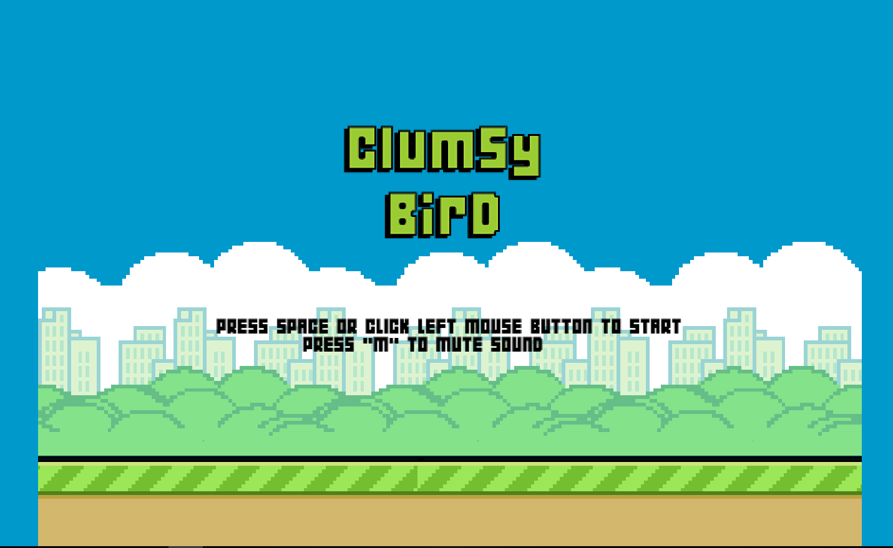
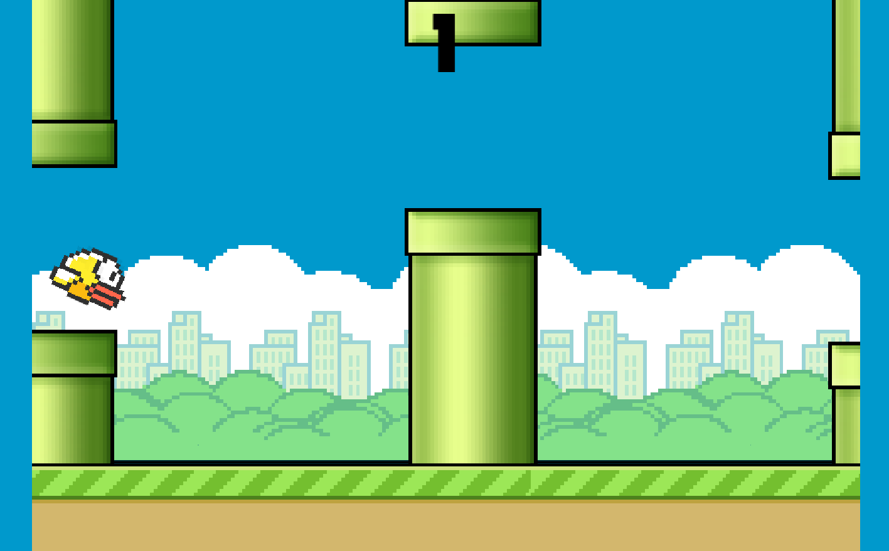
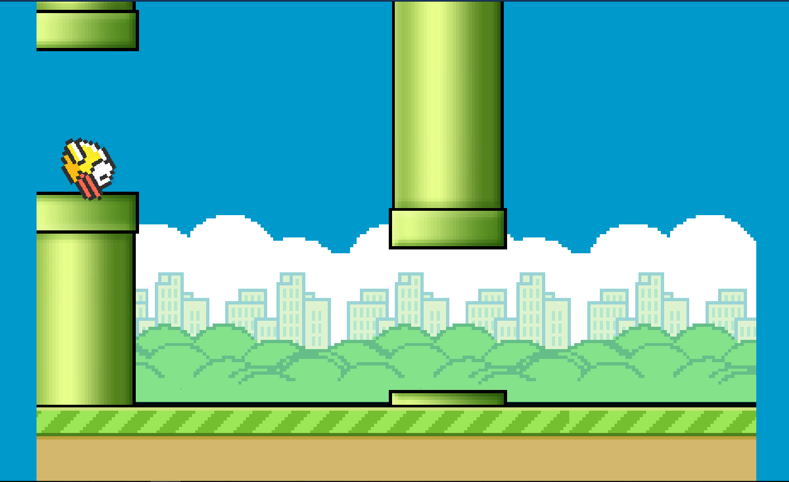
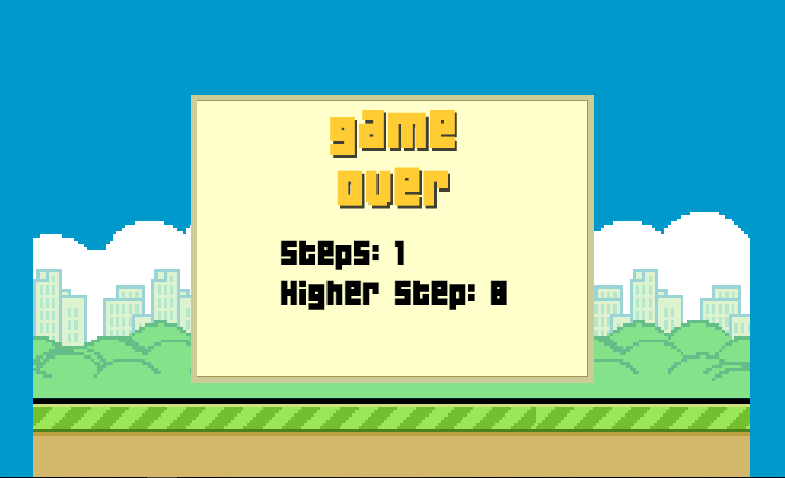

# **Clumsy-Bird**

Try online at http://kiplikipli.my.id

# Contents

- [1. Contents](#contents)
- [2. About](#about)
- [3. Run Locally](#run-locally)
- [4. Installation in Virtual Machine](#installation-in-virtual-machine)
- [5. Customization](#customization)
- [6. How to Play](#how-to-play)
- [7. Discussion](#discussion)
- [8. References](#references)

# About
Clumsy bird is A "Flappy Bird" clone made with MelonJS. Where Flappy Bird itself is a mobile game developed by Vietnamese video game artist and programmer Dong Nguyen, under his game development company dotGears. The game is a side-scroller where the player controls a bird, attempting to fly between columns of green pipes without hitting them.The objective is to direct a flying bird who moves continuously to the right, between sets of Mario-like pipes. If the player touches the pipes, they lose.  

# Run Locally

> 1. Install Node, NPM, and Grunt
> 2. Clone https://github.com/ellisonleao/clumsy-bird/
> 3. Get inside the directory
> 4. Run npm install for installing dependencies
> 5. Run grunt connect
> 6. Open your browser at http://localhost:8100
> 7. Play the game!

# Installation in Virtual Machine

### Using Ubuntu Server

**Pre-requisites :**

> 1. Virtual Box, you can download [here](https://www.virtualbox.org/wiki/Downloads)
> 2. Ubuntu Server, you can download [here](https://ubuntu.com/download/server)
> 3. Web Server ( ex. Apache or NGINX )

**Steps :**

1. Install web server, in this case i'm using Apache2
   > `sudo apt-get install apache2`
2. Get into apache2 root folder in /var/www/html
   > `cd /var/www/html`
3. Clone the Clumsy Bird Github repository
   > `git clone https://github.com/ellisonleao/clumsy-bird/`
4. Change the apache2 root folder to a folder that you have cloned before
   > `sudo nano /etc/apache2/sites-enabled/000-default.conf`
   >
   > **From this**  
   >   
   > **To this**  
   > 
   >
   > **Explanation**
   >
   > Change the DocumentRoot path to the Clumsy-Bird directory
5. Do the same thing as 4, but the sites-available one
   > `sudo nano /etc/apache2/sites-available/000-default.conf`
6. Restart Apache2
   > `sudo service apache2 restart`
7. Open localhost:**port** in your host pc, where **port** is the port that you have already set while you set the virtual machine
   > 
8. Play the game!

# Customization
Playing the original game is already Good, but customizing the Interface will make it even better! with this repo you can have your own customized Clumsy Bird to play with your friends
If you want to add your own assets to the game, this is the list of the assets used in this game, Just create or change the image below with youw own customization. Rmember to keep the name and the sizes.

- [bg.png](https://raw.githubusercontent.com/ellisonleao/clumsy-bird/gh-pages/data/img/bg.png) - Size: `900x504px`. This is the Background image used in the game.
- [clumsy.png](https://raw.githubusercontent.com/ellisonleao/clumsy-bird/gh-pages/data/img/clumsy.png) - Size: `255x60px` . This is the bird animation image. It contains 3 animation frames.
- [gameover.png](https://raw.githubusercontent.com/ellisonleao/clumsy-bird/gh-pages/data/img/gameover.png) - Size: `245x132px`. The Game Over logo.
- [gameoverbg.png](https://raw.githubusercontent.com/ellisonleao/clumsy-bird/gh-pages/data/img/gameoverbg.png) - Size: `505x361px`. This is the Game Over square background used for the scores.
- [getready.png](https://raw.githubusercontent.com/ellisonleao/clumsy-bird/gh-pages/data/img/getready.png) - Size: `405x134px`. This is the initial message before the game starts.
- [ground.png](https://raw.githubusercontent.com/ellisonleao/clumsy-bird/gh-pages/data/img/ground.png) - Size: `900x96px`. The animated ground image.
- [logo.png](https://raw.githubusercontent.com/ellisonleao/clumsy-bird/gh-pages/data/img/logo.png) - Size: `351x145px`. The game logo.
- [new.png](https://raw.githubusercontent.com/ellisonleao/clumsy-bird/gh-pages/data/img/new.png) - Size: `48x48px`. This is the NEW notification when the user reaches a new score.
- [pipe.png](https://raw.githubusercontent.com/ellisonleao/clumsy-bird/gh-pages/data/img/pipe.png) - Size: `148x1664px`. Why the hell this is so big?! Because of the logic used for the random pipes position.

# How to Play

1. Open the game in your browser.

2. To start the game, press space or click left mouse.

3. Controls the bird, attempting to fly between columns of green pipes without hitting them.

4. Dont touch the pipe! If you touch the pipes, you lose.

5. And your game will be over!

# Discussion

- Advantages  
1. Easy to build
2. Easy [Customization](#customization)
3. Fun and easy to play
4. Multi platform because it's in web browser ( mobile and desktop )
- Disadvantages
1. Stiff motion because lack of frames
2. No database for storing high score

# References

- How to Install Apache2 in Ubuntu  
( https://phoenixnap.com/kb/how-to-install-apache-web-server-on-ubuntu-18-04 )

- How to Install Virtual Box in Ubuntu  
( https://vitux.com/how-to-install-virtualbox-on-ubuntu/ )

- How To Move an Apache Web Root to a New Location on Ubuntu 16.04  
( https://www.digitalocean.com/community/tutorials/how-to-move-an-apache-web-root-to-a-new-location-on-ubuntu-16-04 )