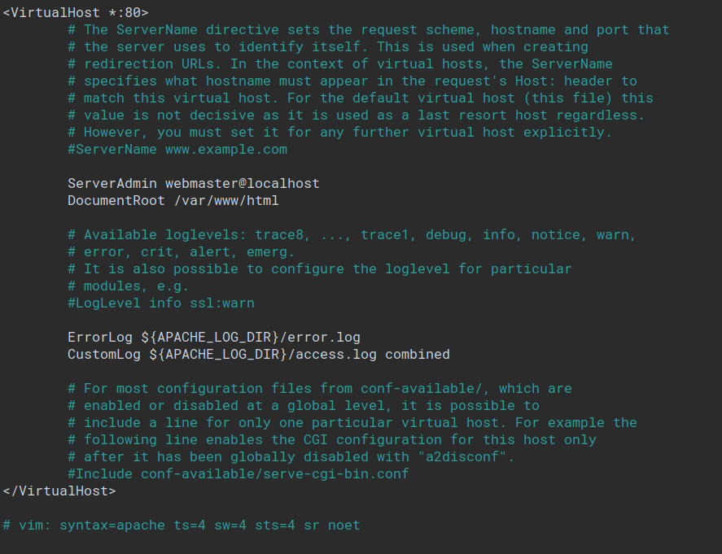
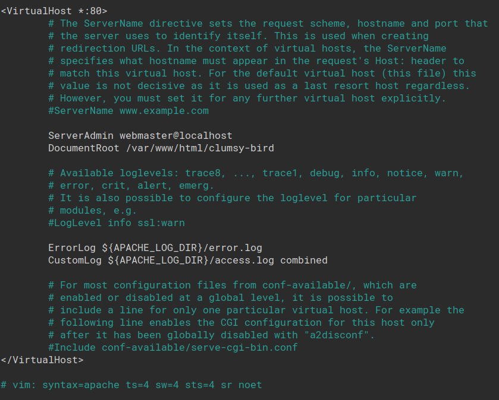
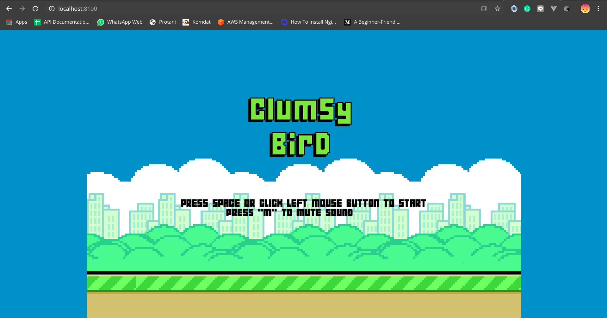

# **Clumsy-Bird**

A "Flappy Bird" clone made with MelonJS.

Try online at http://kiplikipli.my.id

# Contents

- [1. Contents](#contents)
- [2. About](#about)
- [3. Run Locally](#run-locally)
- [4. Installation in Virtual Machine](#installation-in-virtual-machine)

# About

# Run Locally

> 1. Install Node, NPM, and Grunt
> 2. Clone https://github.com/ellisonleao/clumsy-bird/
> 3. Get inside the directory
> 4. Run npm install for installing dependencies
> 5. Run grunt connect
> 6. Open your browser at http://localhost:8100
> 7. Play the game!

# Installation in Virtual Machine

### Using Ubuntu Server

**Pre-requisites :**

> 1. Virtual Box, you can download [here](https://www.virtualbox.org/wiki/Downloads)
> 2. Ubuntu Server, you can download [here](https://ubuntu.com/download/server)
> 3. Web Server ( ex. Apache or NGINX )

**Steps :**

1. Install web server, in this case i'm using Apache2
   > `sudo apt-get install apache2`
2. Get into apache2 root folder in /var/www/html
   > `cd /var/www/html`
3. Clone the Clumsy Bird Github repository
   > `git clone https://github.com/ellisonleao/clumsy-bird/`
4. Change the apache2 root folder to a folder that you have cloned before
   > `sudo nano /etc/apache2/sites-enabled/000-default.conf`
   >
   > **From this**  
   >   
   > **To this**  
   > 
   >
   > **Explanation**
   >
   > Change the DocumentRoot path to the Clumsy-Bird directory
5. Do the same thing as 4, but the sites-available one
   > `sudo nano /etc/apache2/sites-available/000-default.conf`
6. Restart Apache2
   > `sudo service apache2 restart`
7. Open localhost:**port** in your host pc, where **port** is the port that you have already set while you set the virtual machine
   > 
8. Play the game!
